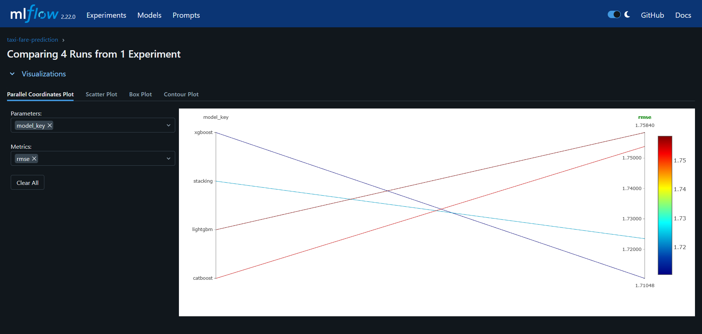
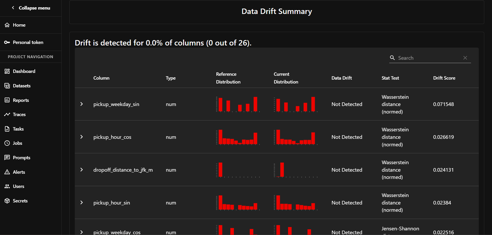
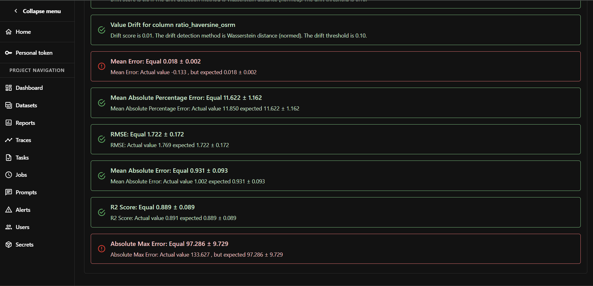
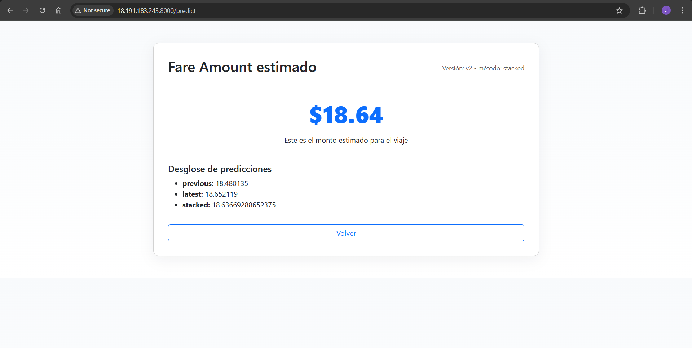

# 🚖 NYC Taxi Fare Prediction  

   
   
   
   
   
   
   
   
   
   
   
   
  

Proyecto MLOps de extremo a extremo que cubre ingesta de datos, preprocesamiento, entrenamiento de modelos, seguimiento de experimentos, despliegue, entrenamiento continuo y monitoreo continuo para predecir tarifas de taxis en Nueva York. Se usaron varias técnicas para optimizar el manejo de la RAM

---

## 📌 Descripción del Proyecto  

**End-to-end MLOps project** para la predicción de tarifas de taxis en Nueva York.  
El flujo cubre:  

- **Ingesta de datos** desde el portal TLC.  
- **EDA y análisis exploratorio** con notebooks para modelos, outliers y uso de OSRM.  
- **Preprocesamiento avanzado** (filtros rígidos, imputaciones, codificación cíclica, normalización, features OSRM).  
- **Entrenamiento y tracking de modelos** (XGBoost, CatBoost, LightGBM, Stacking) con **MLflow**.  
- **Despliegue en Flask + Gunicorn**, orquestado con **Docker Compose**.  
- **Infraestructura en AWS** con Terraform (S3, ECR, EC2).  
- **Continuous Training (CT)** y **Continuous Monitoring (CM)** con EvidentlyAI.  
- **Interfaz interactiva** con Leaflet + Nominatim para predicciones geoespaciales.  

📊 **Resultados principales**:  
- Métrica base: **RMSE = 1.71 (val) y 1.72 (test)**  
- Con CT y CM: mejoras hasta **1.73 RMSE** en stacked models cuando los anteriores tenian valores mayores a **1.74 RMSE**.  

---

## 🔗 Datos y Recursos  

- 📂 **NYC TLC Trip Records** → [TLC Dataset](https://www.nyc.gov/site/tlc/about/tlc-trip-record-data.page?ref=hackernoon.com)  
- 🗺️ **OSRM NYC Map** → [NYC Geofabrik](https://download.geofabrik.de/north-america/us/new-york.html)  
- 🌎 **USA Land Shapefile** → [Census Shapefile](https://www2.census.gov/geo/tiger/GENZ2018/shp/cb_2018_us_nation_5m.zip)  

---

## ⚙️ Pipeline Base  

1. **Data Validation**  
   - Verifica que los datos cumplan formato esperado.  
   - No falla si no coinciden, solo muestra diferencias y avisa.  

2. **Data Ingestion**  
   - Arregla formato.  
   - Convierte strings de fecha a `datetime`.  
   - Genera splits temporales (Train ≈ 25M, Val ≈ 7M, Test ≈ 7M).
   - Elimina coordenadas imposibles.
   - Eliminación de coordenadas en agua (polígono USA).  

3. **Preprocessing**  
   - Filtros rígidos:  
     - Distancias/tiempos negativos o irreales.  
     - Velocidad límite (300 km/h).  
     - Trayectos mayores a 32 días.  
     - Outliers basados en ratios de haversine vs distancia real.
     - Etc.
   - Imputación selectiva.  
   - Codificación cíclica de fechas (sen/cos).  
   - Distancias a POIs (aeropuertos).  
   - Normalización de columnas.  

4. **Data OSRM**  
   - Cálculo de **distancia y tiempo de ruta OSRM**.  
   - Features derivadas de OSRM.  

5. **Model Building & Evaluation**  
Este proyecto incluye tracking de experimentos usando MLflow.
Experimentos realizados:

   - Modelos: **XGBoost, CatBoost, LightGBM, Stacking**.  
   - Métricas: RMSE, MAE, R², MAPE, MEDAE.  
   - Tracking con MLflow.  
   - Selección automática de modelo óptimo usando un promedio ponderado que permite comparación.  
   - Versionado: v1, v2, v3… (feature importances incluidas).  

---

## 🔄 Continuous Training (CT)  

- Nuevos datos cada 3 meses.  
- Reutiliza transformaciones (scaler, imputers, etc).  
- Entrenamiento incremental con **meta-modelo Ridge**.
- Uso de K-Folds para el modelo stacked.  
- Versionado automático si hay mejora con respecto al modelo previo.  

📈 Ejemplo de resultados:  
- Viejo: 1.75  
- Nuevo: 1.74 → Se mueve a v2 para permitir Recursividad en CT
- Stacked: **1.73** → Se promueve a **v2**.  

---

## 📡 Continuous Monitoring (CM)  

### 📊 Monitoreo con EvidentlyAI

Este proyecto incluye monitoreo de **data drift** y **model drift** usando EvidentlyAI.  
Ejemplo de reporte generado:

- Muestreo estratificado (log1p + bins del Target) de 500k datos recientes vs 500k de validación.  
- Validación con **EvidentlyAI**:  
  - Data drift (Wasserstein distance).  
  - Model drift. (Pruebas estadísticas para varias métricas) 
- Detección de drift en diciembre en 1 columna.  
- RMSE pasó de **1.73 → 1.80–1.85**.  

---

## 🌐 Aplicación Web  
Así es como se ve la interfaz de usuario y los resultados que se obtienen:

- Interfaz amigable con el usuario usando **Leaflet + Nominatim**:  
  - Usuario selecciona origen/destino en el mapa.  
  - Conversión de nombres → coordenadas.  
- Input requerido: ['Trip_Pickup_DateTime', 'Passenger_Count', 'Trip_Distance', 'Start_Lon', 'Start_Lat', 'End_Lon', 'End_Lat']

---

## 🌎 Despliegue en AWS  

El proyecto se despliega utilizando **AWS** con la siguiente arquitectura:  

- **S3**: Almacenamiento de datasets.  
- **ECR**: Registro de imagen Docker de la app de flask para el API de predicción.  
- **EC2**: Servidor para desplegar la API en contenedores.  
- **Terraform**: Automatización de la infraestructura en AWS.  
- **GitHub Actions**: Pipeline de CI/CD para automatizar el despliegue. 
- **Docker-compose**: Permite la comunicación entre contenedores y montar volúmenes 

---

## 🛠️ Tecnologías Clave  

- **Lenguaje**: Python 3.11.13  
- **Versionado de Datos**: DVC  
- **Tracking de Experimentos**: MLflow  
- **Orquestación de Pipelines**: DVC 
- **Contenerización**: Docker-compose 
- **Infraestructura como Código**: Terraform  
- **Nube**: AWS (S3, ECR, EC2)  
- **CI/CD**: GitHub Actions  
- **Monitoreo**: Evidently AI  

---

## 📝 Notas

- **Limitaciones**:  
  - El **pipeline base** funciona únicamente con datos de **2009**.  
  - Los módulos de **CT** (Continuous Training) y **CM** (Continuous Monitoring) admiten datos de **2009 y 2010**.  
  - Esto se debe a que la página oficial de los datos de taxi **cambió los nombres de las columnas en 2010**.  
  - A partir de **2011**, los datos ya no contienen coordenadas exactas, sino que fueron reemplazados por **zonas de taxi**.  
  - Aunque es posible descargar datos históricos de **2011 a 2016** con coordenadas, existen limitaciones debido al **tamaño de los datos a descargar**.  

- **Airflow**:  
  - No se integró en este proyecto debido a la **baja accesibilidad a datos con coordenadas**, lo cual dificulta la orquestación en escenarios más amplios.
 
- Se eliminaron los recursos de la nube utilizando `terraform destroy` para evitar costos adicionales y liberar la infraestructura provisionada.
---

## 📈 Resultados Observados vs Benchmark

| Métrica | Validación | Test | Benchmark Kaggle |
|---------|-----------|------|----------------|
| RMSE    | 1.71      | 1.72 | 1er lugar 1.3, 3er lugar 2.0 |
